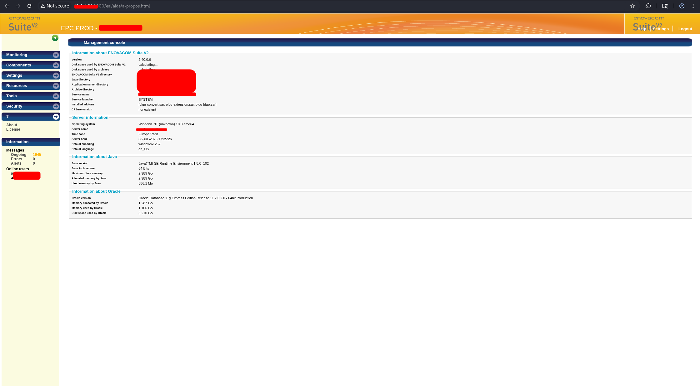
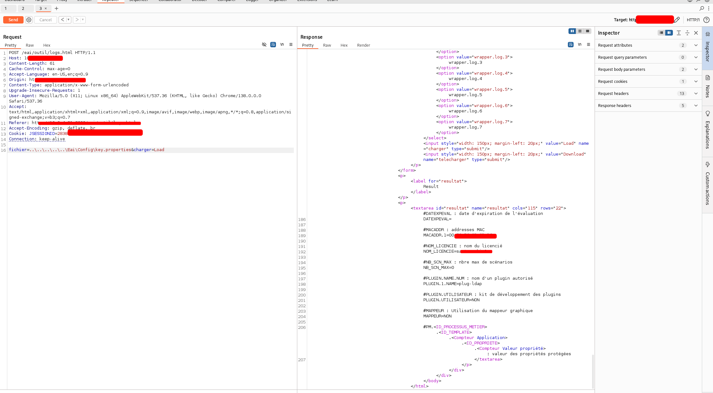
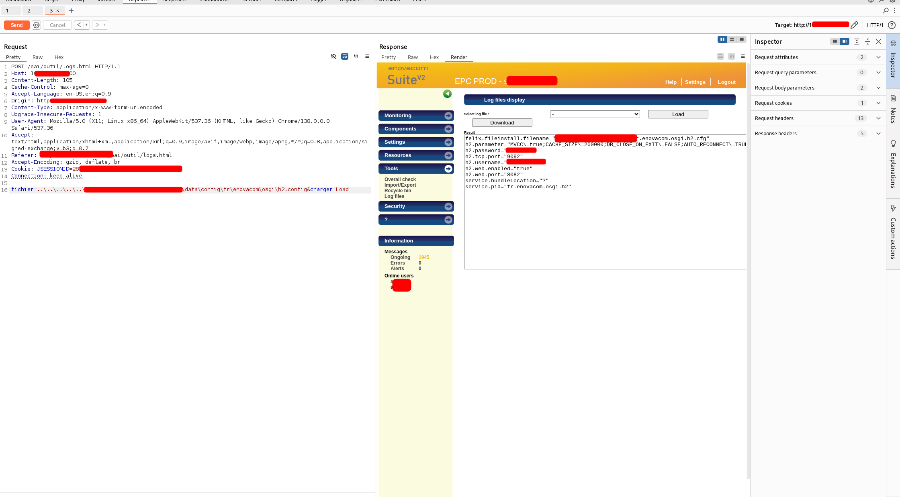

# Arbitrary File Read via Log Viewer – ENOVACOM SUITE V2  

## Description  
After accessing the ENOVACOM SUITE V2 (**2.40.0.6**) application using valid creds, we identified a functionality that allows the consultation of server log files.  

Further analysis of this functionality revealed a vulnerability: it is possible to manipulate the requests in order to read arbitrary files present on the server, not just those listed in the provided dropdown menu.  

No mechanism appears to restrict file path access, which allows a malicious user to view, for example:  
- Configuration files containing passwords or keys  
- Backup files  
- System files or application internals  

---

## Impact  
- **Sensitive information disclosure**: passwords, configurations, private keys, technical data  
- **Privilege escalation**: possible if credentials are retrieved from exposed files  
- **Extended exploitation**: infrastructure can be compromised if critical files are accessed  
- **Confidentiality breach**: loss of control over the server hosting the application  

---

## Proof of Concept  

The following screenshot shows the manipulation of the log loading request, by adding a path to configuration files, as well as the display of the file contents in the server’s response.  

  
  
 

---

## Remediation options  

### Restrict log reading functionality  
- Limit accessible files to an explicit whitelist  
- Prohibit the use of dynamic or user-provided paths  

### Implement server-side validation  
- Reject any attempt to access arbitrary paths (e.g., `../` traversal, absolute paths)  
- Use secure IDs or aliases to reference authorized files  

### Apply least privilege principle  
- Ensure the application does not run with permissions allowing it to read the entire filesystem  
